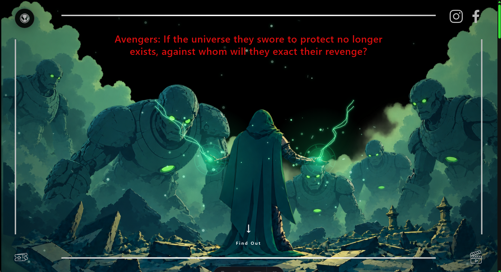

# Avengers: Doomsday FanPage

<p align="center">
  
  
  
</p>

<p align="center">
  A fan-made educational website inspired by <strong>Avengers: Doomsday</strong>.
</p>

> **Disclaimer**
>
> This is a fan-made educational project. It is not affiliated with Marvel Studios, Disney, or any official Avengers production.
>
> The purpose of this project is purely educational and focused on learning, experimentation, and frontend development practice.
>
> All names, logos, characters, and references to Marvel and Avengers belong to their respective owners.



---

## Project Purpose

Inspired by [MiduDev](https://midu.dev) and his *Spiderman: Brand New Day* project, this website was created as a personal frontend project to explore modern web development techniques.

The main goals are:

* Practice professional frontend development workflows.
* Explore modular and scalable project architecture.
* Apply separation of concerns across components, data, styles, and behavior.
* Experiment with GSAP animations and scroll-based interactions.
* Build an interactive cinematic experience using Astro.
* Improve responsive design and frontend development skills.
* Practice Git workflows using `develop`, feature branches, and pull requests.

---

## Tech Stack

| Technology                               | Purpose                                                     |
| :--------------------------------------- | :---------------------------------------------------------- |
| [Astro](https://astro.build/)            | Component-based framework for building fast web experiences |
| [GSAP](https://gsap.com/)                | Animations, transitions, and scroll-based interactions      |
| [Tailwind CSS](https://tailwindcss.com/) | Utility-first styling system                                |
| TypeScript                               | Typed JavaScript development                                |
| pnpm                                     | Package management                                          |

---

## Architecture

The project follows a **Feature/Section-Oriented Architecture** combined with **Separation of Concerns**.

The main responsibilities are divided as follows:

* `components/` → UI and rendering.
* `data/` → Content and configuration.
* `lib/` → Application behavior and logic.
* `styles/` → Global styling and design tokens.
* `layouts/` → Shared document structure.
* `pages/` → Application routes.

This structure keeps visual components, content, and application behavior independent from each other.

---

## Project Structure

```text
avengers_doomsday_fanmadeweb/
│
├── public/
│   ├── favicon/
│   ├── fonts/
│   ├── icons/
│   ├── images/
│   │   ├── characters/
│   │   ├── crew/
│   │   ├── environments/
│   │   ├── gallery/
│   │   └── movies/
│   └── videos/
│
├── src/
│   │
│   ├── assets/
│   │
│   ├── components/
│   │   ├── layout/
│   │   ├── sections/
│   │   │   ├── Hero/
│   │   │   ├── Trailer/
│   │   │   ├── Synopsis/
│   │   │   ├── Cast/
│   │   │   ├── Crew/
│   │   │   ├── Gallery/
│   │   │   ├── MovieInfo/
│   │   │   └── Release/
│   │   └── ui/
│   ├── data/
│   ├── lib/
│   │   ├── animations/
│   │   ├── effects/
│   │   ├── navigation/
│   │   ├── carousel/
│   │   ├── utils/
│   │   │
│   │   └── main.ts
│   │
│   ├── layouts/
│   │   └── BaseLayout.astro
│   │
│   ├── pages/
│   │   └── index.astro
│   │
│   └── styles/
│       ├── global.css
│       ├── theme.css
│       └── utilities.css
│
├── .gitignore
├── AGENTS.md
├── CLAUDE.md
├── astro.config.mjs
├── package.json
├── pnpm-lock.yaml
├── pnpm-workspace.yaml
├── README.md
└── tsconfig.json
```

---

## Features

### Hero

* Layered visual composition.
* GSAP-based animations.
* Parallax effects.
* Animated phrases.
* Interactive navigation controls.

### Trailer

* Responsive video presentation.
* Styled cinematic container.
* Responsive layout.

### Synopsis

* Structured movie information.
* Responsive typography and layout.

### Cast

* Interactive cast cards.
* Actor and character imagery.
* Team identification.
* Responsive carousel.
* Mobile interaction support.

### Crew

* Interactive crew cards.
* Featured work information.
* Responsive carousel.

### Gallery

* Interactive card stack.
* GSAP transitions.
* Previous and next navigation.
* Image counter.
* Lightbox presentation.

### Preloader

* Animated cinematic introduction.
* Incursion-inspired visual effect.
* GSAP timeline synchronization.
* Controlled transition into the main experience.

### Release

* Movie release date.
* Dynamic countdown.
* Atmospheric visual effects.
* Project information card.

### Corner Menu

* Fixed circular navigation.
* Section-based navigation.
* Active section detection.
* Scroll-based state updates.
* GSAP transitions.
* Responsive interaction.

---

## Commands

All commands are executed from the project root.

| Command            | Action                               |
| :----------------- | :----------------------------------- |
| `pnpm install`     | Install project dependencies         |
| `pnpm dev`         | Start the local development server   |
| `pnpm build`       | Build the production site            |
| `pnpm preview`     | Preview the production build locally |
| `pnpm astro check` | Run Astro and TypeScript checks      |
| `pnpm astro ...`   | Run Astro CLI commands               |

The development server runs by default at:

```text
http://localhost:4321
```

---

## Development Workflow

The project follows a feature-oriented Git workflow.

```text
main
  ↑
develop
  ↑
feature/*
```

New functionality should be developed in a dedicated feature branch and merged into `develop` through a pull request.

Example:

```bash
git checkout develop
git pull origin develop

git checkout -b feature/gallery-improvements
```

After completing the feature:

```bash
git add .
git commit -m "feat(gallery): improve gallery interactions"

git push -u origin feature/gallery-improvements
```

The feature branch should then be reviewed and merged into `develop`.

---

## Learning Goals

This project is part of my ongoing frontend development journey.

The main learning objectives are:

* Understand modern Astro architecture.
* Improve TypeScript usage.
* Build reusable and maintainable components.
* Apply separation of concerns.
* Develop animation systems with GSAP.
* Create responsive interfaces with Tailwind CSS.
* Organize frontend projects using scalable architecture.
* Practice professional Git workflows and pull requests.

---

## Credits

Inspired by the work and educational content of [MiduDev](https://midu.dev).

This project is independently developed for educational and personal learning purposes.

---

## Disclaimer

This website is a non-commercial fan-made project.

It is not affiliated with, endorsed by, sponsored by, or connected to Marvel Studios, Disney, or any official Avengers production.

All intellectual property, characters, names, logos, and related materials belong to their respective owners.
